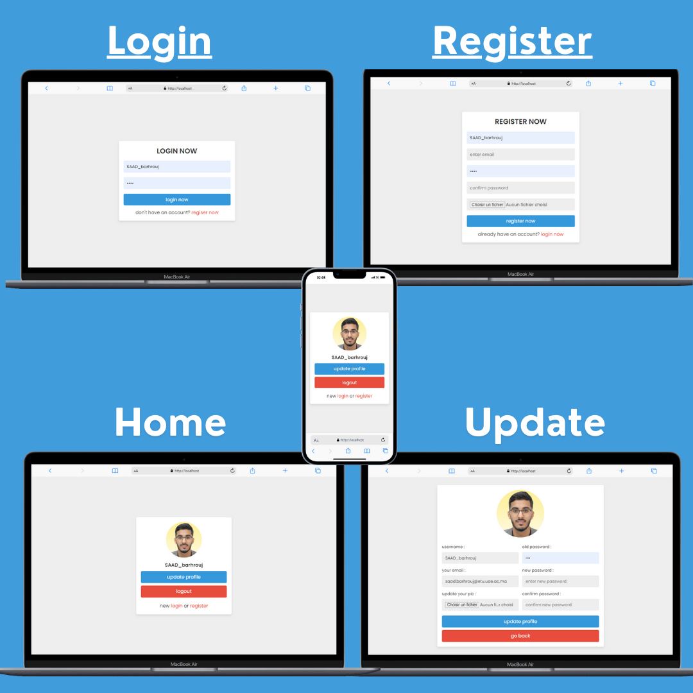

    

# PHP-UserForm-System 🌟

A straightforward PHP-based user management system that covers essential functionalities for registration, login, and profile updates. Ideal for beginners to learn user authentication and session management in PHP.

## Key Features 🚀

- **User Registration**: Allows users to register with a username, email, password, and profile image.
- **User Login**: Secure login system that verifies user credentials and manages sessions.
- **Profile Update**: Enables users to update their profile information, including changing their password and updating their profile picture.
- **Security Measures**: Passwords are hashed using MD5, and inputs are sanitized to prevent SQL injection.

## Contribution

Feel free to fork the repository and contribute to the project. For any issues or suggestions, please open an issue or submit a pull request. 💡

## Contact

For any inquiries or feedback, you can reach me via:

- **Email:** [Saad Barhrouj](saad.barhrouj@etu.uae.ac.ma) 📧
- **LinkedIn:** [Saad Barhrouj](https://www.linkedin.com/in/saad-barhrouj-b37270295/) 💼
- **GitHub:** [SaadBarhrouj](https://github.com/SaadBarhrouj) 🐙
